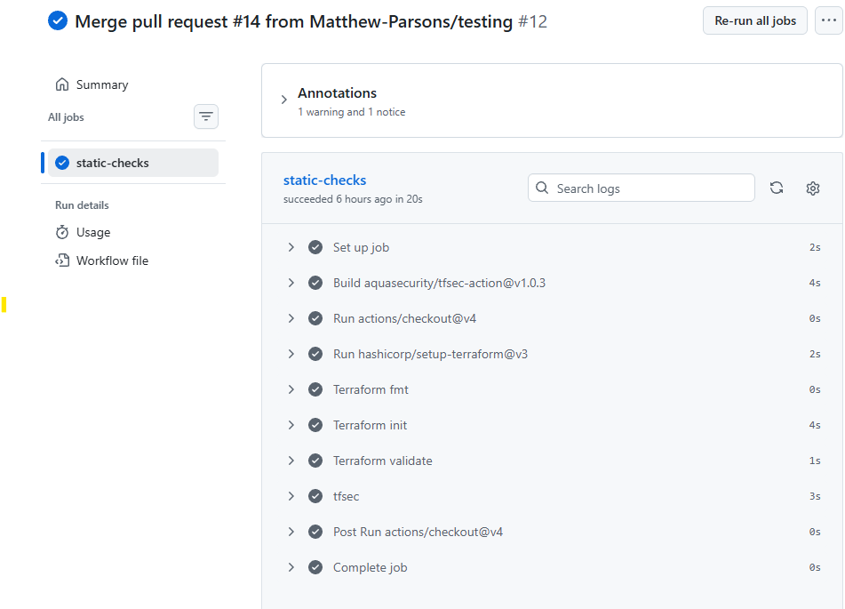
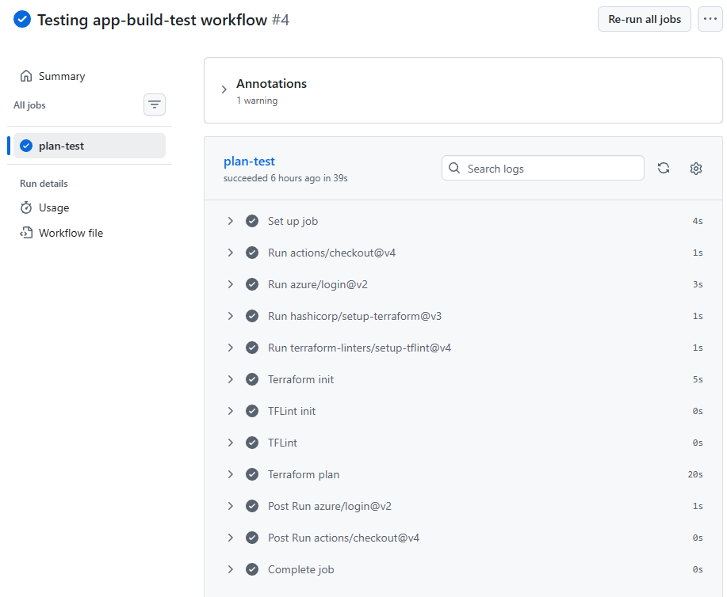
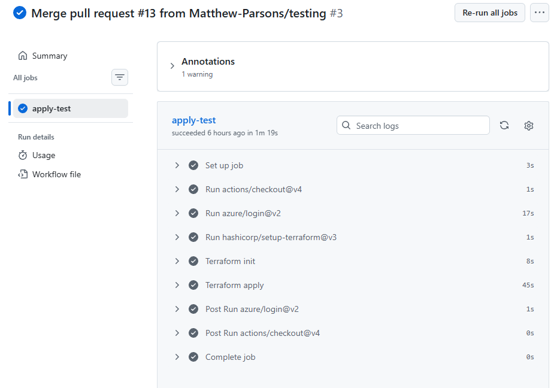
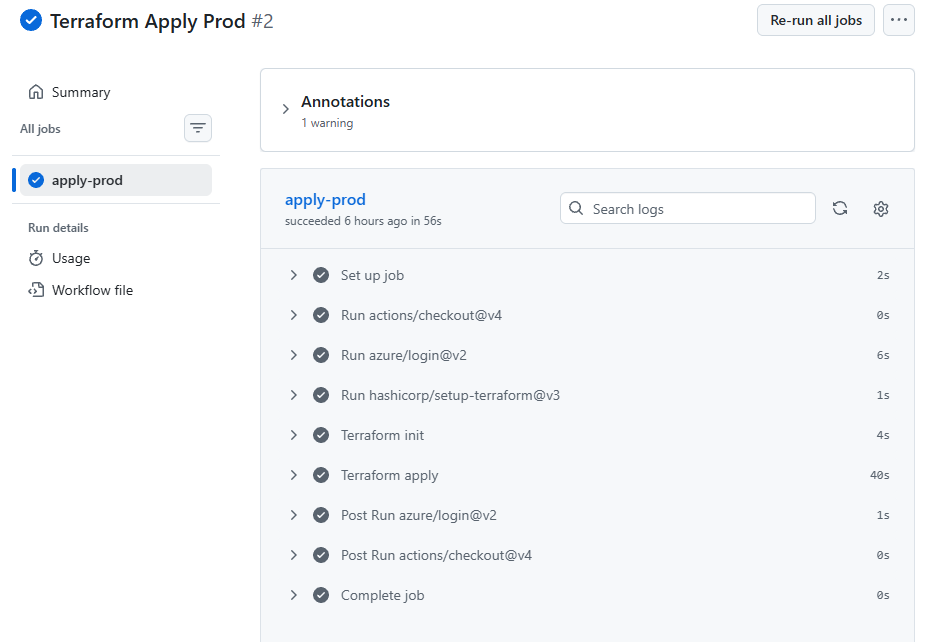
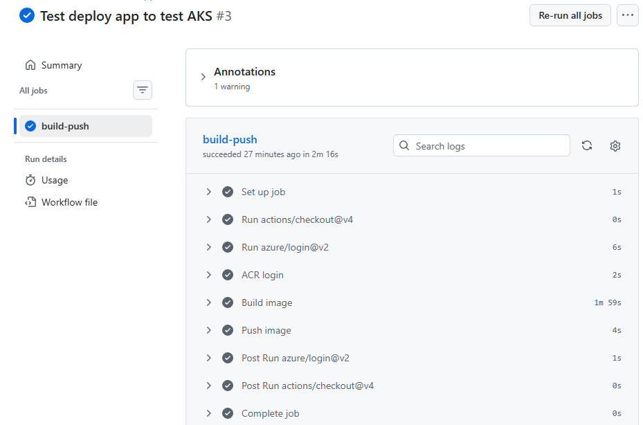
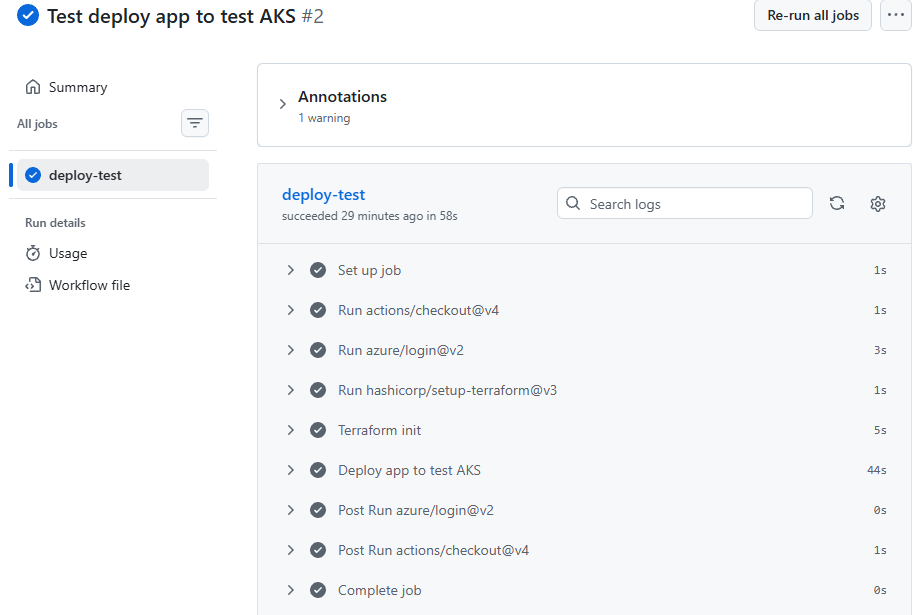
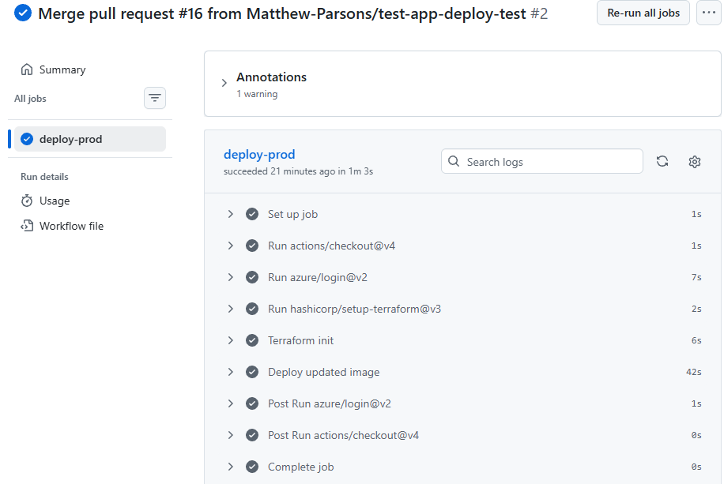

# CST8918 Final Project – Remix Weather Application on Azure AKS

## Project Overview

This capstone project applies the many Infrastructure as Code (IaC) topics that you have learned this term. You will revisit the Remix Weather Application from week 3 and use Terraform to creat the required Azure resources. Your project will deploy Azure Kubernetes Service (AKS) clusters and a managed Redis DB to support the Remix Weather Application. You will use GitHub Actions to automate the Terraform workflows.

The Azure configuration will be stored in a Terraform backend in Azure Blob Storage. The Terraform code will be organized into modules to manage the resources. The project will simulate a real-world scenario with multiple team members collaborating on the project, and multiple environments (dev, test, prod) to manage.

---

## Team Members

- Matthew Parsons  
  https://github.com/Matthew-Parsons

- Jediael Mendoza  
  https://github.com/mend0214

- Dom Healis  
  https://github.com/DomHeallis

- Obaida Kandakji 
  https://github.com/ObaidaKandakji

---

## Architecture

The project provisions the following Azure resources:

- Resource Group
- Virtual Network with subnets:
  - dev
  - test
  - prod
  - admin
- Azure Container Registry (ACR)
- Azure Kubernetes Service (AKS):
  - Test cluster
  - Production cluster
- Azure Redis Cache:
  - Test instance
  - Production instance

---

## Technologies Used

- Remix (Node.js)
- Docker
- Azure Kubernetes Service (AKS)
- Azure Container Registry (ACR)
- Azure Redis Cache
- Terraform
- GitHub Actions

---

## CI/CD Workflows

- **Terraform Static Checks**  
  Runs on push. Performs formatting, validation, and security checks.

  <p align="center">
    
  </p>

- **Terraform PR Checks**  
  Runs on pull requests. Executes Terraform plan and linting.

  <p align="center">
    
  </p>

- **Terraform Apply Test**  
  Runs on push to the main branch. Applies Terraform configuration to the test environment.

  <p align="center">
    
  </p>

- **Terraform Apply Production**  
  Runs after the test deployment completes successfully. Applies Terraform configuration to the production environment.

  <p align="center">
    
  </p>

- **Build and Push Weather App**  
  Runs on pull request when application code changes. Builds the Docker image and pushes it to Azure Container Registry.

  <p align="center">
    
  </p>

- **Deploy App to Test**  
  Runs on pull request to the main branch when application code changes. Deploys the application to the test AKS cluster.

  <p align="center">
    
  </p>

- **Deploy App to Production**  
  Runs on push to the main branch when application code changes. Deploys the application to the production AKS cluster.

  <p align="center">
    
  </p>

---

## Required GitHub Secrets

The following secrets must be configured in the repository:

- AZURE_CLIENT_ID
- AZURE_TENANT_ID
- AZURE_SUBSCRIPTION_ID
- WEATHER_API_KEY
- ACR_NAME
- ACR_LOGIN_SERVER

---

## Instructions for Running the Project

### Step 1: Clone the Repository

```bash
git clone https://github.com/Matthew-Parsons/CST8918-Final-Project
cd <your-repo>
```

### Step 2: Deploy Terraform Backend

Go to your backend configuration (if you have a backend folder or `main.tf` for it):

```bash
cd terraform/backend
terraform init
terraform apply
```

This will create:
- Storage account
- Blob container for Terraform state

---

### Step 3: Deploy Infrastructure

Now that the backend exists, deploy environments.

#### Test Environment

```bash
cd ../environments/test
terraform init
terraform apply
```

#### Production Environment

```bash
cd ../prod
terraform init
terraform apply
```

---

### Step 4: Run the Application Locally (Optional)

Start a local Redis server.

If you are using Docker:

```bash
docker run -d -p 6379:6379 redis
```
Then start the application:

```bash
cd app
npm install
npm run dev
```

The application will be available at:

```http://localhost:3000```

---

### Step 5: Deploy via GitHub Actions

* Pull Request → deploys to **test**
* Merge to main → deploys to **production**

